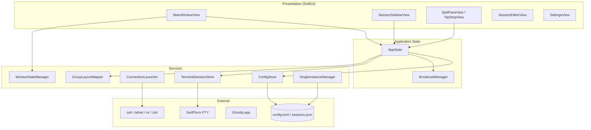
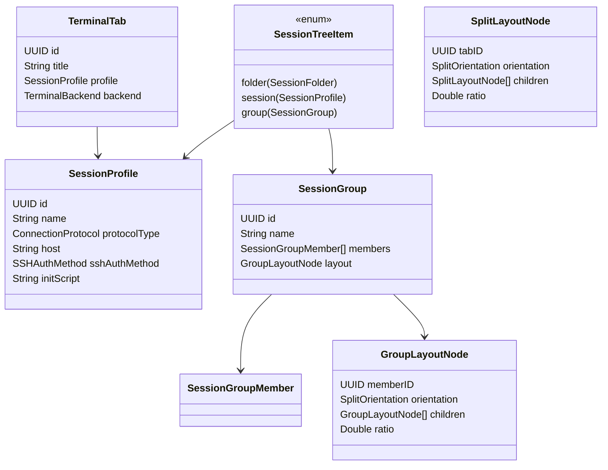
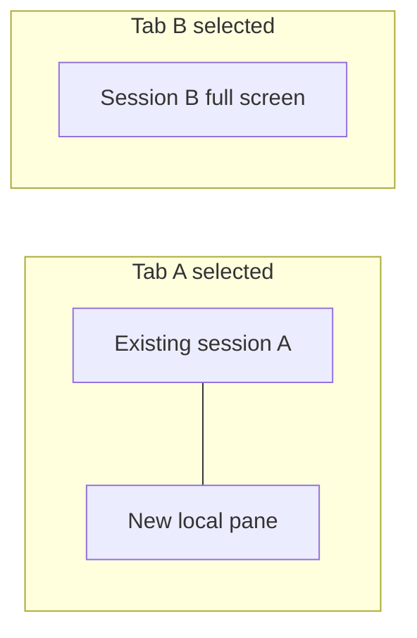
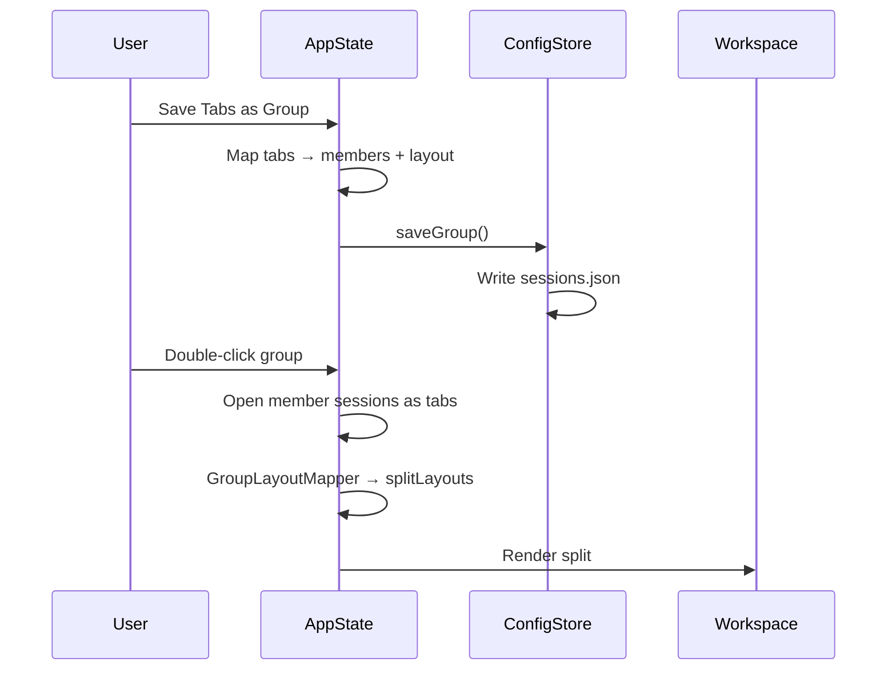
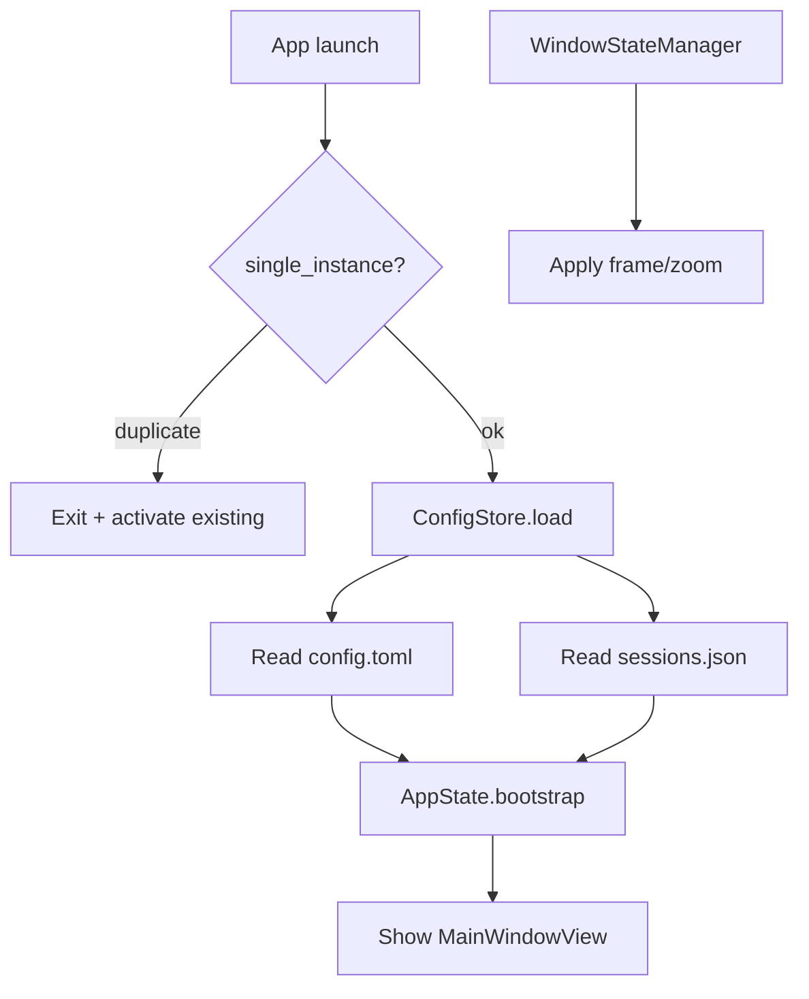
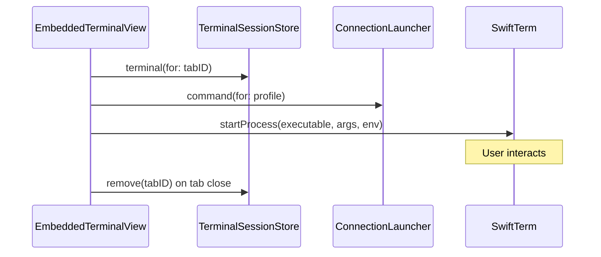

# High-Level Design: Terminal Manager

**Version:** 1.0  
**Platform:** macOS 14+, Swift 5.9, SwiftUI + AppKit

---

## 1. Architecture Overview

Terminal Manager is a single-process macOS desktop app. SwiftUI drives the UI; AppKit hosts embedded terminal views (SwiftTerm) and window management. Configuration is file-based with no server component.



---

## 2. Layer Responsibilities

### 2.1 Presentation

| Component | Responsibility |
|-----------|----------------|
| `MainWindowView` | Split navigation, tab strip, workspace, toolbar |
| `SessionSidebarView` | Session tree, DnD, context menus, groups |
| `EmbeddedTerminalView` | NSViewRepresentable bridge to SwiftTerm |
| `SessionEditorView` | Profile editor sheets |
| `SettingsView` | In-app settings; writes `config.toml` |

### 2.2 Application State (`AppState`)

Central `@MainActor` observable object:

| State | Description |
|-------|-------------|
| `tabs` | Open `TerminalTab` instances |
| `selectedTabID` | Active tab in tab strip |
| `splitLayouts` | Map of anchor tab ID → split tree for that tab’s workspace |
| `detachedTabs` | Tabs torn off to separate windows |
| `configStore` | Loaded settings and session tree |

Key operations: open/close tab, per-tab split, open/save group, tab reorder, bootstrap.

### 2.3 Services

| Service | Role |
|---------|------|
| `ConfigStore` | Load/save `config.toml` and `sessions.json`; CRUD for tree, groups, folders |
| `TomlConfigCodec` | TOML ↔ `AppSettings` |
| `TerminalSessionStore` | One `LocalProcessTerminalView` per tab ID |
| `ConnectionLauncher` | Build argv/env for ssh, telnet, local shell, etc. |
| `TerminalEnvironment` | PTY environment inheritance |
| `BroadcastManager` | Fan-out typed commands to embedded tabs |
| `GroupLayoutMapper` | Convert `SplitLayoutNode` ↔ `GroupLayoutNode` |
| `WindowStateManager` | Persist/restore window frame and zoom |
| `SingleInstanceManager` | File lock + distributed notification for single instance |
| `GhosttyBridge` | AppleScript launch for external terminal / SFTP |
| `SSHAuthHelper` | Askpass scripts for password auth |
| `AppLogger` | File + os_log logging |

---

## 3. Data Models



---

## 4. Tab & Split Layout Model

Each tab can have an independent split layout stored in `AppState.splitLayouts`, keyed by an **anchor tab ID**.



**Split action (`splitSelectedTab`):**

1. Take focused tab as anchor (existing PTY unchanged)
2. Append one new tab with a local shell profile
3. Store `SplitLayoutNode.split(orientation, anchor, newTab)` under anchor ID
4. If anchor already in a split tree, replace that pane with a nested split

**Workspace rendering (`SplitPaneView`):**

- Resolve layout via `splitLayout(containing: selectedTabID)`
- Mount all tabs in `tabs[]` but only show tabs in the active layout (others hidden, not destroyed)
- Resize PTY when pane frames change

---

## 5. Session Groups

Groups are sidebar entries that reference sessions by profile ID and optionally store a split layout using **member IDs** (stable across open/close).



**Open group:** For each member, resolve `SessionProfile` from tree → `appendTab` → map member IDs to new tab IDs → convert `GroupLayoutNode` to `SplitLayoutNode`.

**Save group:** Reverse mapping from selected tab’s split layout.

---

## 6. Configuration Flow



| Path | Resolution |
|------|------------|
| Default | `~/.terminalmanager/` |
| `TERMINALMANAGER_CONFIG=/path/dir` | Custom directory |
| `TERMINALMANAGER_CONFIG=/path/config.toml` | Parent directory of file |

Legacy migration: copies from `~/Library/Application Support/terminalmanager` on first run if new path is empty.

---

## 7. Terminal Lifecycle



- One PTY process per tab ID
- Tabs stay mounted during splits; visibility toggles via layout
- Environment variables inherited from parent process with session overrides

---

## 8. Threading & Concurrency

| Area | Model |
|------|--------|
| UI + AppState | `@MainActor` |
| Config I/O | Main thread (sync file ops) |
| PTY I/O | SwiftTerm background threads |
| Logging | Thread-safe `AppLogger` |

---

## 9. Security Considerations

- Passwords stored in `sessions.json` (plain text); file permissions rely on OS user home directory
- SSH askpass scripts written to config directory with restrictive permissions
- Ghostty integration requires macOS Automation (AppleScript) permission
- No network listeners; outbound connections only via user-initiated sessions

---

## 10. Source Layout

```
Sources/terminalmanager/
├── App/
│   ├── TerminalManagerApp.swift   # @main, menus, scenes
│   ├── AppState.swift             # Central state
│   └── AppDelegate.swift          # Lifecycle, single instance, exit confirm
├── Models/
│   └── Models.swift               # Domain types
├── Services/
│   ├── ConfigStore.swift
│   ├── TomlConfigCodec.swift
│   ├── TerminalSessionStore.swift
│   ├── ConnectionLauncher.swift
│   ├── GroupLayoutMapper.swift
│   ├── WindowStateManager.swift
│   ├── SingleInstanceManager.swift
│   └── ...
└── Views/
    ├── MainWindowView.swift
    ├── SessionSidebarView.swift
    ├── EmbeddedTerminalView.swift
    └── SessionEditorView.swift
```

---

## 11. Dependencies

| Package | Use |
|---------|-----|
| [SwiftTerm](https://github.com/migueldeicaza/SwiftTerm) | Embedded terminal emulator + PTY |
| [TOMLKit](https://github.com/LebJe/TOMLKit) | Parse/encode `config.toml` |

System binaries: `/usr/bin/ssh`, `telnet`, `nc`, user login shell.

---

## 12. Related Documents

- [Functional Specification](SPEC.md)
- [User Guide](USER_GUIDE.md)
