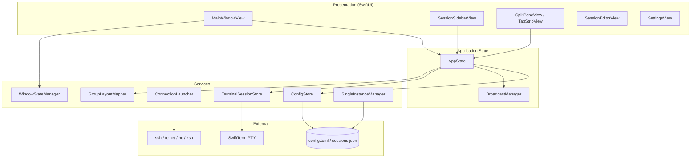
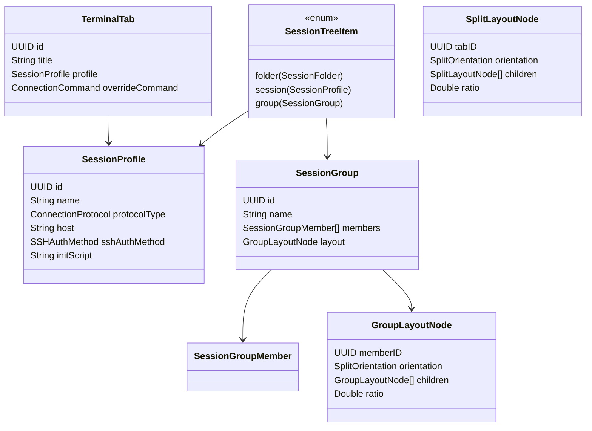
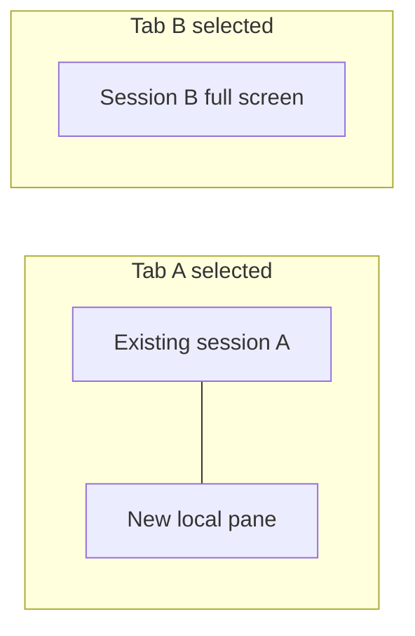
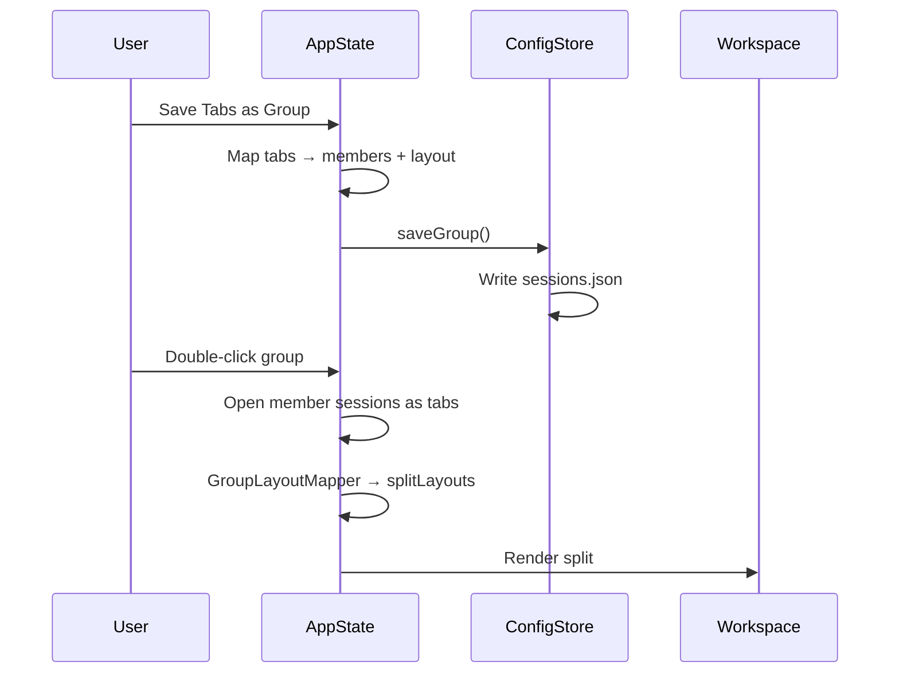
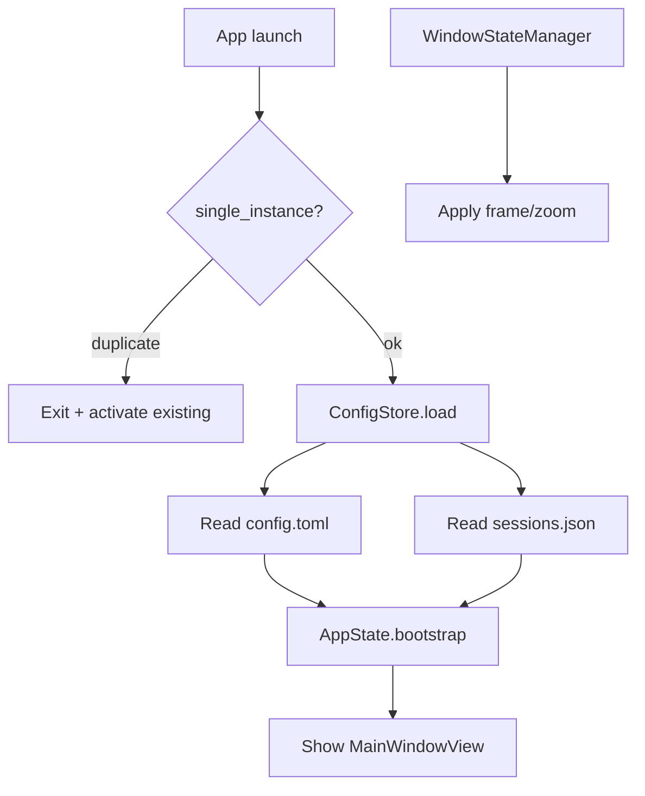
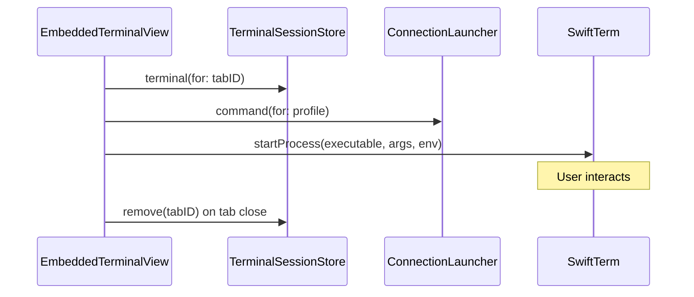
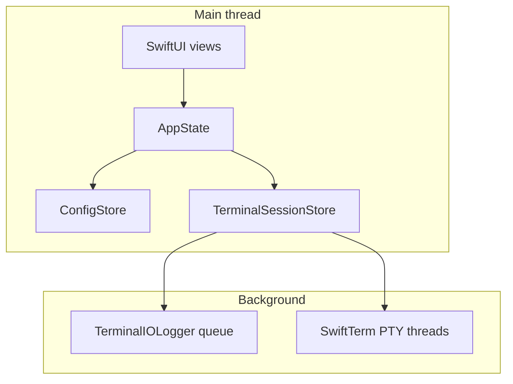
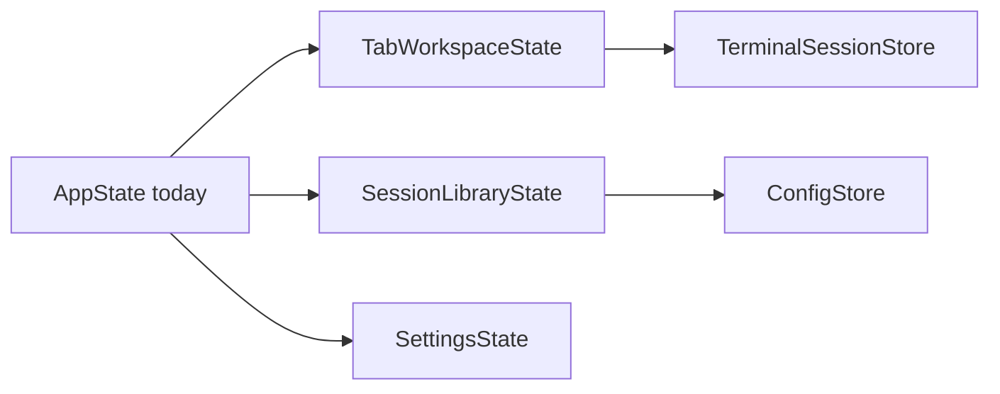

# High-Level Design: Terminal Manager

**Version:** 1.1  
**Platform:** macOS 14+, Swift 5.9, SwiftUI + AppKit

---

## 1. Architecture Overview

Terminal Manager is a single-process macOS desktop app. SwiftUI drives the UI; AppKit hosts embedded terminal views (SwiftTerm) and window management. Configuration is file-based with no server component.



---

## 2. Layer Responsibilities

### 2.1 Presentation

| Component | Responsibility |
|-----------|----------------|
| `MainWindowView` | Split navigation, tab strip, workspace, toolbar |
| `SessionSidebarView` | Session tree, DnD, context menus, groups |
| `EmbeddedTerminalView` | NSViewRepresentable bridge to SwiftTerm |
| `SessionEditorView` | Profile editor sheets |
| `SettingsView` | In-app settings; writes `config.toml` |
| `UserGuideView` | Help → User Guide; renders bundled `USER_GUIDE.md` as HTML |

### 2.2 Application State (`AppState`)

Central `@MainActor` observable object:

| State | Description |
|-------|-------------|
| `tabs` | Open `TerminalTab` instances |
| `selectedTabID` | Active tab in tab strip |
| `splitLayouts` | Map of anchor tab ID → split tree for that tab’s workspace |
| `detachedTabs` | Tabs torn off to separate windows |
| `configStore` | Loaded settings and session tree |

Key operations: open/close tab, per-tab split, open/save group, tab reorder, bootstrap.

### 2.3 Services

| Service | Role |
|---------|------|
| `ConfigStore` | Load/save `config.toml` and `sessions.json`; CRUD for tree, groups, folders |
| `TomlConfigCodec` | TOML ↔ `AppSettings` |
| `TerminalSessionStore` | One `LocalProcessTerminalView` per tab ID |
| `ConnectionLauncher` | Build argv/env for ssh, telnet, local shell, etc. |
| `TerminalEnvironment` | PTY environment inheritance |
| `BroadcastManager` | Fan-out typed commands to embedded tabs |
| `GroupLayoutMapper` | Convert `SplitLayoutNode` ↔ `GroupLayoutNode` |
| `WindowStateManager` | Persist/restore window frame and zoom |
| `SingleInstanceManager` | File lock + distributed notification for single instance |
| `SSHAuthHelper` | Keychain passwords + askpass for embedded PTY |
| `KeychainSecretStore` | macOS Keychain read/write for session passwords |
| `LaunchStateStore` | Optional tab restore snapshot |
| `SessionTreeFilter` | Sidebar search filter |
| `EncryptedBackup` | AES-GCM backup bundles |
| `AppLogger` | File logging for app events |
| `TerminalIOLogger` | Separate log for terminal input/output |
| `UserGuideLoader` | Load bundled or source `USER_GUIDE.md` for Help |

---

## 3. Data Models



---

## 4. Tab & Split Layout Model

Each tab can have an independent split layout stored in `AppState.splitLayouts`, keyed by an **anchor tab ID**.



**Split action (`splitSelectedTab`):**

1. Take focused tab as anchor (existing PTY unchanged)
2. Append one new tab with a local shell profile
3. Store `SplitLayoutNode.split(orientation, anchor, newTab)` under anchor ID
4. If anchor already in a split tree, replace that pane with a nested split

**Workspace rendering (`SplitPaneView`):**

- Resolve layout via `splitLayout(containing: selectedTabID)`
- Mount terminal views only for tabs visible in the active layout (background tabs keep PTY but no live NSView until selected)
- Resize PTY when pane frames change

---

## 5. Session Groups

Groups are sidebar entries that reference sessions by profile ID and optionally store a split layout using **member IDs** (stable across open/close).



**Open group:** For each member, resolve `SessionProfile` from tree → `appendTab` → map member IDs to new tab IDs → convert `GroupLayoutNode` to `SplitLayoutNode`.

**Save group:** Reverse mapping from selected tab’s split layout.

---

## 6. Configuration Flow



| Path | Resolution |
|------|------------|
| Default | `~/.terminalmanager/` |
| `TERMINALMANAGER_CONFIG=/path/dir` | Custom directory |
| `TERMINALMANAGER_CONFIG=/path/config.toml` | Parent directory of file |

Legacy migration: copies from `~/Library/Application Support/terminalmanager` on first run if new path is empty.

---

## 7. Terminal Lifecycle



- One PTY process per tab ID once started
- Process starts when tab becomes active and has non-zero bounds (`EmbeddedTerminalView.startIfNeeded`)
- PTY and SwiftTerm scrollback remain allocated until tab close or future hibernation (see §13)
- Environment variables inherited from parent process with session overrides

---

## 8. Threading & Concurrency

| Area | Model |
|------|--------|
| UI + AppState | `@MainActor` |
| Config I/O | Main thread today; **planned:** off-main encode/write ([SPEC §9.4 PF-03](SPEC.md#94-phase-30--performance-quick-wins-v30)) |
| PTY I/O | SwiftTerm background threads |
| App logging | Thread-safe `AppLogger` |
| Terminal I/O log | Dedicated utility queue (`TerminalIOLogger`); batched output flush (~50 ms) |
| Encrypted backup | PBKDF2 + AES-GCM on caller thread today; **planned:** async with progress ([SPEC §9.7 PF-33](SPEC.md#97-phase-33--startup--io-v33)) |

**Invalidation today:** `ConfigStore.objectWillChange` forwards to `AppState.objectWillChange`, which can redraw the full window. Phase 3.0 (PF-05, TE-02) narrows this to granular published slices.

---

## 9. Security Considerations

- SSH passwords stored in **macOS Keychain** (`KeychainSecretStore`); migrated from legacy plain text in `sessions.json` on load
- Temporary SSH askpass scripts may still be written for embedded PTY password auth; restrictive permissions (`0o700`)
- Encrypted backup bundles use AES-GCM with passphrase-derived keys (PBKDF2)
- No network listeners; outbound connections only via user-initiated sessions
- Session notes may still contain secrets in plain text ([SPEC §9.8 EN-08](SPEC.md#98-phase-40--product-enhancements-post-performance))

---

## 10. Source Layout

```
Sources/terminalmanager/
├── App/
│   ├── TerminalManagerApp.swift   # @main, menus, scenes
│   ├── AppState.swift             # Central state
│   └── AppDelegate.swift          # Lifecycle, single instance, exit confirm
├── Models/
│   └── Models.swift               # Domain types
├── Services/
│   ├── ConfigStore.swift
│   ├── TomlConfigCodec.swift
│   ├── TerminalSessionStore.swift
│   ├── ConnectionLauncher.swift
│   ├── GroupLayoutMapper.swift
│   ├── WindowStateManager.swift
│   ├── SingleInstanceManager.swift
│   └── ...
└── Views/
    ├── MainWindowView.swift
    ├── SessionSidebarView.swift
    ├── EmbeddedTerminalView.swift
    └── SessionEditorView.swift
```

---

## 11. Dependencies

| Package | Use |
|---------|-----|
| [SwiftTerm](https://github.com/migueldeicaza/SwiftTerm) | Embedded terminal emulator + PTY |
| [TOMLKit](https://github.com/LebJe/TOMLKit) | Parse/encode `config.toml` |

System binaries: `/usr/bin/ssh`, `telnet`, `nc`, user login shell.

---

## 12. Build & Packaging

```
swift build -c release
        │
        ▼
scripts/package-app.sh release
        │
        ├── Terminal Manager.app  (Contents/MacOS, Info.plist, resources)
        │
        └── scripts/create-dmg.sh (optional)
                    │
                    ▼
            dist/Terminal Manager-<version>.dmg
```

The Makefile wraps these steps (`make package-release`, `make dmg`). App bundle assembly copies the release binary, `Info.plist`, `config.toml.example`, and `docs/USER_GUIDE.md` into `Contents/Resources`.

---

## 13. Performance & scale

**Version 2.x baseline** and **Phase 3 plan** are defined in [SPEC §9](SPEC.md#9-phase-3--performance--scale). This section summarizes architecture implications.

### 13.1 Main-thread hot path



### 13.2 Optimizations already in place

| Mechanism | Location | Effect |
|-----------|----------|--------|
| Visible-tab-only terminal views | `MainWindowView` / `SplitPaneView` | Avoids mounting NSViews for every open tab |
| Debounced session save | `ConfigStore.scheduleSaveSessions` (250 ms) | Coalesces rapid tree edits |
| Buffered terminal I/O log | `TerminalIOLogger` | Reduces syscall churn; rotation by `terminal_io_max_mb` |
| Release LTO + strip | `Package.swift` | Smaller binary |

### 13.3 Known bottlenecks (Phase 3 targets)

| Bottleneck | Planned mitigation | SPEC ID |
|------------|-------------------|---------|
| Synchronous `launch-state.json` on tab ops | Debounced write via `PersistenceCoordinator` | PF-01 |
| Full-tree sidebar filter per keystroke | Debounce + search index | PF-02, PF-21 |
| Main-thread `sessions.json` encode | Off-main write | PF-03 |
| Recursive tree lookup | UUID index | PF-04, TE-07 |
| Broad `objectWillChange` fan-out | Split `AppState` | PF-05, TE-02 |
| Unbounded scrollback per tab | `max_scrollback_lines` | PF-06 |
| PTY alive for all started tabs | Tab hibernation + lazy start | PF-10, PF-11, TE-06 |

### 13.4 Planned state decomposition (TE-02)



| Model | Owns |
|-------|------|
| `TabWorkspaceState` | `tabs`, `selectedTabID`, `splitLayouts`, detached tabs, reconnect |
| `SessionLibraryState` | `sessionTree`, search index, selection |
| `SettingsState` | `AppSettings`, appearance, logging toggles |
| `PersistenceCoordinator` | Debounced/off-main writes for sessions, launch state, window state |

### 13.5 Measurement

Before Phase 3.0, record baselines with Instruments (Time Profiler, Allocations, File Activity) using a 20-tab workload. Targets: see [SPEC §9.10](SPEC.md#910-measurement-targets).

---

## 14. Related Documents

- [Functional Specification](SPEC.md)
- [User Guide](USER_GUIDE.md)
