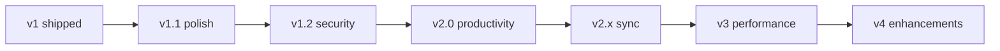
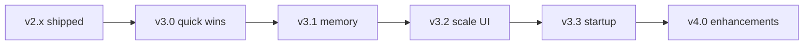
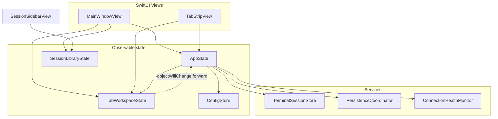

# Functional Specification: Terminal Manager

**Product:** Terminal Manager (`terminalmanager`)  
**Platform:** macOS 14+  
**Status:** v1 baseline shipped · v1.1–v2.x roadmap implemented · **v3 performance plan shipped** · **v4 product enhancements largely shipped** (see [§8](#8-roadmap--enhancement-status), [§9](#9-phase-3--performance--scale))

**Document version:** 2026-06-14 · reflects Phase 3 performance + Phase 4 product enhancements

---

## 1. Product Overview

Terminal Manager is a native macOS application that consolidates multiple terminal sessions—SSH, Telnet, Rlogin, raw TCP, and local shells—into a single tabbed window with a session sidebar, split panes, session groups, and portable configuration.

### 1.1 Goals

- Reduce desktop clutter from many terminal windows
- Provide saved connection profiles organized in folders and groups
- Support repeatable multi-session workflows (groups with split layouts)
- Keep configuration human-editable and portable (`config.toml` + `sessions.json`)

### 1.2 Non-Goals (v1) and deferred items

These remain **out of scope** unless listed in [§8](#8-roadmap--enhancement-status) or [§9.8](#98-phase-40--product-enhancements-post-performance).

| Item | Notes |
|------|-------|
| Windows/Linux ports | macOS-only for foreseeable releases |
| Full asciinema / cast playback | Asciinema v2 `.cast` export shipped (EN-03); in-app playback deferred |
| Sparkle auto-update UI | GitHub release check shipped (EN-07); Sparkle framework optional later |
| Native XCUITest target | ✅ `TerminalManagerUITests` Xcode target + `make ui-test` (EN-09) |
| Multi-user or cloud sync | Optional folder/iCloud mirror shipped (AB-20); no server sync |
| External terminal backends | Removed; embedded SwiftTerm only |
| Bundled SSH implementation | Uses system `ssh`, `telnet`, `nc`, `sftp` |

---

## 2. Functional Requirements

### 2.1 Session Management

| ID | Requirement | Status |
|----|-------------|--------|
| SM-01 | Create, edit, duplicate, delete session profiles | ✅ |
| SM-02 | Organize sessions in folders (nested tree) | ✅ |
| SM-03 | Drag-and-drop reorder and move sessions between folders | ✅ |
| SM-04 | Double-click session to open in new tab | ✅ |
| SM-05 | Export / import session tree as JSON | ✅ |
| SM-06 | Protocols: SSH, Telnet, Rlogin, Raw TCP, Local shell | ✅ |
| SM-07 | SSH auth: agent, password, private key | ✅ |
| SM-08 | Per-session init script after connect | ✅ |
| SM-09 | Optional SFTP launch in embedded tab | ✅ |
| SM-10 | SSH ProxyJump / bastion field | ✅ |
| SM-11 | Per-session SSH extra options | ✅ |
| SM-12 | Duplicate session to folder | ✅ |
| SM-13 | Test connection (non-interactive probe) | ✅ |
| SM-20 | Session templates in config | ✅ |
| SM-21 | `terminalmanager://` URL scheme | ✅ |
| SM-22 | Reusable bastion / jump-host profiles (`[[bastions]]`) | ✅ config + session editor picker |
| SM-23 | Per-session remote environment and working directory | ✅ profile fields + tab overrides (TW-15) |
| SM-24 | Session notes in Keychain (optional) | ✅ `SessionNotesHelper` + editor toggle |

### 2.2 Session Groups

| ID | Requirement | Status |
|----|-------------|--------|
| SG-01 | Save open tabs (+ split layout) as a named group | ✅ |
| SG-02 | Groups hold references to existing sessions, not copies | ✅ |
| SG-03 | Double-click group opens all members with saved layout | ✅ |
| SG-04 | Drag session onto group to add reference | ✅ |
| SG-05 | Duplicate, rename, delete group via context menu | ✅ |
| SG-06 | Remove group member via context menu Delete | ✅ |
| SG-07 | Save group from open tabs (empty groups also supported via context menu) | ✅ |
| SG-10 | Create empty group | ✅ |
| SG-11 | Update group layout from open tabs | ✅ |

### 2.3 Tabs & Workspace

| ID | Requirement | Status |
|----|-------------|--------|
| TW-01 | Multi-tab strip with reorder via drag-and-drop | ✅ |
| TW-02 | Rename tab (double-click or context menu) | ✅ |
| TW-03 | Detach tab to separate window; reattach | ✅ |
| TW-04 | Horizontal / vertical split on focused tab only | ✅ |
| TW-05 | Split preserves existing session; adds duplicate of same profile in new pane | ✅ |
| TW-06 | Per-tab split layouts (switching tabs restores each layout) | ✅ |
| TW-07 | Close tab removes it from that tab’s split only | ✅ |
| TW-10 | Tab status indicator (idle / running / exited) | ✅ |
| TW-11 | Restore last open tabs on launch (optional) | ✅ |
| TW-12 | Auto-reconnect prompt on unexpected exit | ✅ |
| TW-13 | Split pane duplicates session protocol | ✅ |
| TW-14 | Connection health / stale tab indicator (configurable) | ✅ orange dot when no recent output |
| TW-15 | Per-tab remote env / cwd overrides (context menu) | ✅ overrides profile defaults for one tab |

### 2.4 Command Broadcast

| ID | Requirement | Status |
|----|-------------|--------|
| BC-01 | Command toolbar sends input to selected or all tabs | ✅ |
| BC-02 | Toggle toolbar visibility (View menu + config) | ✅ |
| BC-03 | Focus command bar (⌘⇧L); shows bar if hidden | ✅ |
| BC-10 | Command bar history | ✅ |
| BC-11 | Named broadcast presets | ✅ |

### 2.5 Application Behavior

| ID | Requirement | Status |
|----|-------------|--------|
| AB-01 | Single-instance mode (config.toml) | ✅ |
| AB-02 | Restore window position / zoom between launches | ✅ |
| AB-03 | Optional confirm-on-exit dialog | ✅ |
| AB-04 | Portable config via `TERMINALMANAGER_CONFIG` | ✅ |
| AB-05 | File logging with configurable level | ✅ |
| AB-06 | Terminal I/O log with rotation and toggle | ✅ |
| AB-07 | Restore open tabs on launch (optional) | ✅ |
| AB-08 | Encrypted session backup (passphrase) | ✅ |
| AB-12 | Export sessions with secrets redacted | ✅ |
| AB-20 | Optional sync path for sessions file | ✅ |
| AB-21 | Encrypted backup bundle | ✅ |
| AB-22 | Check for updates (GitHub releases) | ✅ optional on launch + Session menu |
| DP-02 | CI workflow (build, test, package) | ✅ |
| DP-03 | Release workflow on version tag | ✅ `.github/workflows/release.yml` (notarize optional) |

### 2.6 Terminal

| ID | Requirement | Status |
|----|-------------|--------|
| TB-01 | Embedded terminal (SwiftTerm) for all sessions | ✅ |
| TB-10 | Configurable terminal font and size | ✅ |
| TB-11 | Terminal theme (system / light / dark) | ✅ |
| TB-12 | Copy-on-select; paste on middle-click | ✅ `[performance.copy_on_select]`, `paste_on_middle_click` |
| TB-20 | Find in terminal scrollback (⌘F) | ✅ |
| TB-21 | Session transcript export (scrollback or selection) | ✅ Session menu + `TranscriptExporter` |
| TB-22 | Tab I/O log export (metadata or content, redacted) | ✅ `TerminalIOLogExporter` |
| TB-23 | Custom ANSI color palette | ✅ `[performance.ansi_palette]` |
| TB-24 | Plain-text session recording | ✅ `logs/recordings/` when enabled |
| TB-30 | SFTP directory browser (basic) | ✅ |
| TB-31 | SFTP upload / download and path bookmarks | ✅ `SFTPTransferService` + bookmarks on profile |

### 2.7 UX & Editor (v1 baseline)

| ID | Requirement | Status |
|----|-------------|--------|
| UX-01 | Connection URI parsing (`ssh://`, `ssh2://`, `telnet://`, `rlogin://`) | ✅ |
| UX-02 | Edit menu actions for sidebar tree (folder, session, group) | ✅ |
| UX-03 | In-app User Guide (Help → Terminal Manager Help, ⌘?) | ✅ |
| UX-04 | Optional tooltips on controls (`show_tooltips`) | ✅ |
| UX-05 | Separate terminal I/O log (`terminal-io-*.log`) | ✅ |
| UX-10 | Sidebar search / filter | ✅ |
| UX-11 | Quick Connect bar in main window | ✅ |
| UX-12 | Session tag color in sidebar | ✅ |
| UX-20 | Detached window remembers size/position per tab | ✅ |
| UX-21 | Session notes panel (markdown preview) | ✅ toggle in session editor |

### 2.8 Security

| ID | Requirement | Status |
|----|-------------|--------|
| SEC-01 | SSH passwords in Keychain (migrate from JSON) | ✅ |
| SEC-02 | Optional Keychain storage for session notes | ✅ |

### 2.9 Quality

| ID | Requirement | Status |
|----|-------------|--------|
| QA-01 | Unit tests (URI, launcher, filter, layout, config) | ✅ 35+ test suites |
| QA-02 | UI / integration smoke tests | ✅ `GUISmokeTests`, `ProcessLaunchSmokeTests`, `-smoke-test`, `scripts/ui-smoke.sh` |
| QA-03 | Phase 4 feature tests (health, palette, migration, export) | ✅ |

---

## 3. User Interface

### 3.1 Main Window

- **Navigation split:** Session sidebar (optional) + detail workspace
- **Quick Connect bar:** URI or `user@host` field above tabs (optional)
- **Command toolbar:** Broadcast target picker + command field with history and presets (optional)
- **Tab strip:** Tab chips with status dot, connection-health dot (stale), close, detach, rename, remote overrides, reorder
- **Find bar:** In-terminal search (⌘F) when a tab is focused
- **Workspace:** Single terminal or split panes for the selected tab’s layout
- **SFTP panel:** Optional file browser with upload/download when session has SFTP enabled

### 3.2 Sidebar

- Tree: folders, sessions, groups
- Search field filters by name, host, protocol, notes
- Tag color dot beside session names (optional per profile)
- Single-click select; double-click open (session/group) or expand (folder)
- Context menus: Test Connection, Duplicate to Folder, empty group, update group layout
- Toolbar actions when item selected (Connect, Open Group, Save as Group, Edit, Duplicate)

### 3.3 Menus

| Menu | Key actions |
|------|-------------|
| File | New Tab (⌘T), Close Tab (⌘W) |
| Edit | New Folder, Rename/Delete Folder, New Session, Create Group from Open Tabs; export transcript, selection, I/O log; reveal recording |
| Session | Duplicate, next/prev tab, split H/V, focus command bar, Check for Updates |
| View | Show sidebar, show command bar, show tooltips |
| Help | Terminal Manager Help (⌘?) — in-app User Guide |

In-app help renders `docs/USER_GUIDE.md` from the app bundle.

---

## 4. Configuration Files

### 4.1 Layout

| File | Purpose |
|------|---------|
| `config.toml` | Application settings |
| `sessions.json` | Session / folder / group tree |
| `window-state.json` | Saved window frame and zoom (auto) |
| `launch-state.json` | Open tabs for restore-on-launch (auto) |
| `instance.lock` | Single-instance lock file (auto) |
| `logs/terminalmanager-*.log` | App events and errors |
| `logs/terminal-io-*.log` | Terminal input and shell output |
| `logs/recordings/` | Plain-text session recordings (when enabled) |

Default directory: `~/.terminalmanager/`

Override: environment variable `TERMINALMANAGER_CONFIG` (directory or path to `config.toml`).

### 4.2 `config.toml` Schema

```toml
[app]
version = 1
single_instance = false

[window]
start_maximized = false
restore_position = true

[terminal]
font_name = "Menlo"
font_size = 12
theme = "system"                 # system | light | dark
restore_tabs_on_launch = false
auto_reconnect = true

[ui]
show_sidebar = true
show_command_bar = true
show_tooltips = true
broadcast_enabled = true
confirm_on_exit = false

[sessions]
file = "sessions.json"
# sync_path = "~/path/to/synced/sessions.json"

[logging]
level = "info"                   # debug | info | warning | error
log_terminal_io = true
terminal_io_max_mb = 50

[performance]
launch_state_debounce_ms = 500
sidebar_search_debounce_ms = 150
max_scrollback_lines = 10000
sessions_save_off_main = true
hibernate_inactive_tabs_minutes = 30
terminal_io_metadata_only = false
defer_sessions_load = true
stagger_tab_restore = true
stagger_tab_restore_batch_size = 3
find_debounce_ms = 200
broadcast_batch_delay_ms = 15
config_schema_version = 2        # migrated by ConfigMigration on load
copy_on_select = false
paste_on_middle_click = true
stale_tab_minutes = 5            # 0 = disable connection health indicator
session_recording_enabled = false
session_recording_format = "plain"  # plain | asciinema
check_for_updates = true
update_repository = "owner/repo" # GitHub releases API

# Optional custom ANSI palette (16 colors)
# [performance.ansi_palette]
# black = "#000000"
# red = "#CC0000"

# Reusable SSH bastion profiles (referenced from session editor)
# [[bastions]]
# id = "UUID"
# name = "Corp Bastion"
# host = "bastion.example.com"
# username = "alice"
# port = 22

[[shortcuts]]
id = "newTab"            # newTab | closeTab | nextTab | prevTab | duplicateSession | commandBar
key = "t"
modifiers = ["command"]
```

See `config.toml.example` for a complete template. On first load after upgrade, `ConfigMigration` bumps `config_schema_version` and preserves user values.

### 4.3 `sessions.json` Schema

Root object:

| Field | Type | Description |
|-------|------|-------------|
| `version` | int | Schema version (currently `1`) |
| `sessionTree` | array | Top-level tree items |

Tree items encode as tagged objects (Swift `Codable`):

**Folder**

```json
{
  "folder": {
    "id": "UUID",
    "name": "Production",
    "children": [ /* SessionTreeItem[] */ ]
  }
}
```

**Session**

```json
{
  "session": {
    "id": "UUID",
    "name": "WebServer",
    "host": "web01.example.com",
    "port": 22,
    "username": "admin",
    "protocolType": "ssh",
    "sshAuthMethod": "agent",
    "password": "",
    "sshKeyPath": null,
    "initScript": "cd /var/log",
    "startupScriptPath": null,
    "sftpEnabled": true,
    "notes": "",
    "notesInKeychain": false,
    "initialDirectory": null,
    "remoteEnvironment": "export FOO=bar",
    "remoteWorkingDirectory": "/var/log",
    "bastionProfileID": null,
    "sftpBookmarks": ["/var/www", "/home/admin"]
  }
}
```

Optional Phase 4 session fields (omitted when unset): `notesInKeychain`, `remoteEnvironment`, `remoteWorkingDirectory`, `bastionProfileID` (references `[[bastions]]` in config), `sftpBookmarks`.

**Group**

```json
{
  "group": {
    "id": "UUID",
    "name": "Web Stack",
    "members": [
      { "id": "UUID", "sessionID": "UUID" }
    ],
    "layout": {
      "id": "UUID",
      "orientation": "horizontal",
      "memberID": null,
      "children": [
        { "id": "UUID", "memberID": "UUID", "children": [], "ratio": 0.5 },
        { "id": "UUID", "memberID": "UUID", "children": [], "ratio": 0.5 }
      ],
      "ratio": 0.5
    }
  }
}
```

`layout` uses `memberID` on leaf nodes (maps to `SessionGroupMember.id`). Omitted or `null` when the group has no saved split.

---

## 5. Keyboard Shortcuts (Default)

| Action | Shortcut |
|--------|----------|
| New tab | ⌘T |
| Close tab | ⌘W |
| Next tab | ⌘⇧] |
| Previous tab | ⌘⇧[ |
| Duplicate tab | ⌘D |
| Focus command bar | ⌘⇧L |
| Find in terminal | ⌘F |

Shortcuts are configurable in `config.toml` under `[[shortcuts]]`.

---

## 6. Build & Deploy

### Makefile

| Target | Purpose |
|--------|---------|
| `make build` | Debug Swift build |
| `make build-release` | Release Swift build |
| `make package` | Assemble `Terminal Manager.app` (debug) |
| `make package-release` | Assemble release app bundle |
| `make run` | Bootstrap config, package, open (`CONFIG=release` optional) |
| `make bootstrap` | Seed config directory from `config.toml.example` |
| `make dmg` | Release build + `dist/Terminal Manager-<version>.dmg` |
| `make notarize` | Sign and notarize DMG (requires Apple Developer credentials) |
| `make test` | Run Swift tests (~126 cases) |
| `make clean` | Remove `.build`, app bundle, and `dist/` |

### Scripts

| Script | Purpose |
|--------|---------|
| `scripts/bootstrap-config.sh` | Create `~/.terminalmanager` from example if missing |
| `scripts/package-app.sh [debug\|release]` | Build binary and assemble `Terminal Manager.app` |
| `scripts/create-dmg.sh` | Release build, stage app + Applications link, write DMG to `dist/` |
| `scripts/notarize-dmg.sh` | Sign app/DMG and submit to Apple notarization |
| `scripts/run-app.sh [debug\|release]` | Bootstrap config, package, and open app |
| `scripts/ui-smoke.sh` | Headless GUI smoke via `-smoke-test` CLI flag |

### Distribution

- DMG filename version comes from `CFBundleShortVersionString` in `Resources/Info.plist`.
- DMG contents: `Terminal Manager.app`, symlink to `/Applications`.
- **CI:** `.github/workflows/ci.yml` runs build + tests on push/PR; `release.yml` builds release artifact on `v*` tag push.
- Local builds are unsigned by default; Gatekeeper may block until the user allows the app manually.
- For public distribution: sign with Apple Developer ID, notarize via `notarytool` (`make notarize` or CI secrets in `release.yml`).

---

## 8. Roadmap & Enhancement Status

Phases **1.1–4.0** are largely **shipped** (see §2, §9). Status key: ✅ Done · ⚠️ Partial · 📋 Deferred.

Priorities: **P0** — high impact or blocker · **P1** — significant UX/value · **P2** — nice-to-have · **P3** — optional depth.

### 8.1 Phase overview

| Phase | Target | Theme | Status |
|-------|--------|-------|--------|
| **1.1** | v1.1 | Distribution, discoverability, terminal polish | ✅ Shipped |
| **1.2** | v1.2 | Security, SSH depth, session lifecycle | ✅ Shipped |
| **2.0** | v2.0 | Productivity, search, recording | ✅ Shipped |
| **2.x** | v2.x+ | Sync, automation, SFTP UI | ✅ Shipped |
| **3.0–3.3** | v3.x | Performance & scale | ✅ Shipped (see §9.3–§9.7) |
| **4.0** | v4.0 | Product enhancements post-performance | ✅ Largely shipped (see §9.8) |



---

### 8.2 Phase 1.1 — Polish & distribution (v1.1)

| ID | Priority | Requirement | Status |
|----|----------|-------------|--------|
| DP-01 | P0 | Apple Developer ID signing + `notarytool` notarization for release DMG | ⚠️ `release.yml` + `notarize-dmg.sh` (requires Apple credentials + tag push) |
| DP-02 | P1 | CI workflow: build, test, release artifact on tag | ✅ `.github/workflows/ci.yml` + `release.yml` |
| UX-10 | P1 | Sidebar search / filter by name, host, protocol | ✅ |
| UX-11 | P1 | Quick Connect field (URI or `user@host`) in main window | ✅ |
| UX-12 | P2 | Session color tag or icon override in sidebar | ✅ |
| TW-10 | P1 | Tab status indicator (running / exited / disconnected) | ✅ |
| TW-11 | P2 | Restore last open tabs on launch (optional `config.toml`) | ✅ |
| TB-10 | P1 | Configurable terminal font and size in Settings | ✅ |
| TB-11 | P2 | Configurable color theme (light/dark/custom ANSI palette) | ✅ system / light / dark + optional `[performance.ansi_palette]` |
| AB-10 | P2 | Log rotation / max size for `terminal-io-*.log` | ✅ |
| AB-11 | P2 | Toggle terminal I/O logging in Settings | ✅ |

---

### 8.3 Phase 1.2 — Security & connections (v1.2)

| ID | Priority | Requirement | Status |
|----|----------|-------------|--------|
| SEC-01 | P0 | Store SSH passwords in macOS Keychain, not plain text in `sessions.json` | ✅ |
| SEC-02 | P1 | Optional Keychain storage for session notes containing secrets | ✅ |
| SM-10 | P1 | SSH `ProxyJump` / bastion host field | ✅ |
| SM-11 | P1 | Per-session SSH config extras (e.g. `IdentityFile`, `UserKnownHostsFile`) | ✅ |
| SM-12 | P2 | Session duplicate to different folder from context menu | ✅ |
| SM-13 | P2 | “Test connection” action (non-interactive probe) | ✅ |
| TW-12 | P1 | Auto-reconnect prompt when embedded session exits unexpectedly | ✅ |
| TW-13 | P2 | Split pane opens chosen protocol (not local-only) | ✅ |
| AB-12 | P1 | Export sessions JSON with secrets redacted | ✅ |

---

### 8.4 Phase 2.0 — Terminal UX & productivity (v2.0)

| ID | Priority | Requirement | Status |
|----|----------|-------------|--------|
| TB-20 | P1 | Find in terminal scrollback (⌘F) | ✅ |
| TB-21 | P1 | Copy-on-select and configurable paste behavior | ✅ copy-on-select + paste-on-middle-click |
| TB-22 | P2 | Optional session transcript export (selection or tab lifetime) | ✅ scrollback, selection, and I/O log export |
| BC-10 | P1 | Command bar history (recent broadcasts) | ✅ |
| BC-11 | P2 | Named broadcast presets (“deploy”, “status”) | ✅ |
| SG-10 | P2 | Create empty group and add members via drag | ✅ |
| SG-11 | P2 | “Update group layout from open tabs” on existing group | ✅ |
| UX-20 | P1 | Detached window remembers size/position per tab | ✅ |
| UX-21 | P2 | Session notes panel (markdown) in editor | ✅ markdown preview toggle |
| QA-01 | P1 | Automated tests for `ConnectionLauncher`, URI parser, layout mapper | ✅ |
| QA-02 | P2 | UI smoke tests for tab open/close/split | ✅ `scripts/ui-smoke.sh` |

---

### 8.5 Phase 2.x — Sync, automation, SFTP (v2.x+)

| ID | Priority | Requirement | Status |
|----|----------|-------------|--------|
| AB-20 | P2 | Optional sync of `sessions.json` via iCloud Drive or user-chosen folder | ✅ watch + mirror + conflict backup |
| AB-21 | P2 | Encrypted backup bundle (sessions + config) | ✅ |
| SM-20 | P2 | Session templates (defaults for new SSH profiles) | ✅ |
| SM-21 | P2 | Open session from Apple Shortcuts / `terminalmanager://` URL scheme | ✅ |
| TB-30 | P2 | Optional SFTP side panel (file list + transfer) | ✅ browse, upload/download, bookmarks |
| TB-31 | P3 | Session recording to asciinema or plain transcript | ✅ plain text + asciinema v2 `.cast` (`session_recording_format`) |
| DP-03 | P2 | Sparkle or in-app update check | ⚠️ GitHub releases check (Sparkle UI deferred) |

---

### 8.6 Technical enablers (cross-cutting)

| ID | Priority | Enabler | Status |
|----|----------|---------|--------|
| TE-01 | P0 | Keychain-backed secret store abstraction | ✅ `KeychainSecretStore` |
| TE-02 | P1 | Split `AppState` into focused observable models | ✅ `TabWorkspaceState` + `SessionLibraryState` |
| TE-03 | P1 | Tab/session lifecycle state machine (idle → running → exited) | ✅ |
| TE-04 | P2 | Pluggable `ConnectionBackend` tests without UI | ⚠️ Partial (`ConnectionTester`) |
| TE-05 | P2 | Settings schema version + migration in `config.toml` | ✅ `ConfigMigration` v2 |

---

### 8.7 Long-term out of scope

Unless product direction changes, the following are **not** planned:

- Native Windows/Linux clients (consider separate project)
- Built-in VPN or tunnel management
- Multi-user concurrent editing of one config directory
- Replacing system `ssh` with a bundled SSH implementation
- Full IDE / editor integration beyond terminal sessions

---

## 9. Phase 3 — Performance & scale

Phases **3.0–3.3** and **4.0** are **shipped**. Status key: ✅ Done · ⚠️ Partial · 📋 Planned.

Priorities: **P0** — user-visible lag or memory leak · **P1** — scale to power users · **P2** — polish.

### 9.1 Current baseline (v4.x)

| Area | Shipped capability |
|------|-------------------|
| Terminal mounting | Only visible tab/split panes mount `EmbeddedTerminalView` |
| Tab lifecycle | Hibernation, lazy PTY start, detached-window rules |
| Session saves | Debounced off-main `sessions.json` writes |
| Launch state | Debounced `launch-state.json` via `PersistenceCoordinator` |
| Sidebar | Flat row model, background search index, debounced filter |
| Terminal I/O log | Background queue, batched output, rotation, metadata-only mode |
| Observable models | `TabWorkspaceState` for tab workspace; forwarded `objectWillChange` |
| Release builds | LTO + strip; CI + optional release workflow on tag |
| Secrets | Keychain passwords and optional Keychain-backed notes |
| Testing | ~126 unit/integration/GUI smoke tests |

### 9.2 Known pressure points (remaining)

| Area | Issue | Mitigation / status |
|------|--------|---------------------|
| `AppState` | Still coordinates config, settings, terminal store, persistence | ✅ `TabWorkspaceState` + `SessionLibraryState`; 📋 optional `SettingsState` |
| `ConfigStore` | `objectWillChange` can invalidate sidebar + settings together | Narrow bindings in sidebar flat rows; index-backed lookups |
| `TerminalSessionStore` | PTY + scrollback live until tab close or hibernation | ✅ hibernation + scrollback cap |
| Find (⌘F) | Full scrollback scan on debounced query | ✅ debounce + search-from-end; cap highlights |
| Encrypted backup | PBKDF2 120k iterations | ✅ async export/import with progress UI |
| Sparkle / auto-update | Manual download today | GitHub check only; Sparkle deferred |
| XCUITest | `TerminalManagerUITests` Xcode target | `make ui-test` + in-process smoke |

### 9.3 Phase overview

| Phase | Target | Theme | Status |
|-------|--------|-------|--------|
| **3.0** | v3.0 | Quick wins — debouncing, off-main I/O, narrower invalidation | ✅ |
| **3.1** | v3.1 | Memory & tab lifecycle — hibernation, lazy start | ✅ |
| **3.2** | v3.2 | UI scalability — virtualized sidebar, search index | ✅ |
| **3.3** | v3.3 | Startup & sync — staggered restore, async backup | ✅ |
| **4.0** | v4.0+ | Product enhancements (§9.8) | ✅ Largely shipped |



---

### 9.4 Phase 3.0 — Performance quick wins (v3.0)

| ID | Priority | Requirement | Rationale |
|----|----------|-------------|-----------|
| PF-01 | P0 | Debounce `launch-state.json` writes (mirror session save debounce) | ✅ |
| PF-02 | P1 | Debounce sidebar search (150 ms) | ✅ |
| PF-03 | P0 | Off-main encode/write for `sessions.json` | ✅ |
| PF-04 | P1 | Session tree index (`UUID` → item, parent pointers) | ✅ |
| PF-05 | P0 | Narrow SwiftUI invalidation (stop full `AppState` fan-out) | ✅ |
| PF-06 | P1 | Configurable scrollback line cap per tab | ✅ |
| PF-07 | P2 | Document Instruments baseline (20-tab scenario) | ✅ `docs/PERFORMANCE.md` |

**Acceptance notes (3.0):** Tab switch and sidebar search feel instant with 500 sessions; session save does not hitch UI; launch-state write coalesced to ≤1 flush per 500 ms burst.

---

### 9.5 Phase 3.1 — Memory & tab lifecycle (v3.1)

| ID | Priority | Requirement | Rationale |
|----|----------|-------------|-----------|
| PF-10 | P0 | Tab hibernation — terminate inactive PTY after N minutes (configurable) | ✅ `hibernate_inactive_tabs_minutes` |
| PF-11 | P1 | Lazy process start — no PTY until tab first visible (incl. restore-on-launch) | ✅ `SplitPaneView` visibility mount |
| PF-12 | P2 | Same hibernation rules for detached windows | ✅ detached visibility + hibernation |
| PF-13 | P2 | I/O log sampling or metadata-only mode | ✅ `terminal_io_metadata_only` |
| PF-14 | P1 | Eager cleanup on tab close (PTY, broadcast handlers) | ✅ `cleanupTabResources` |

**Acceptance notes (3.1):** 20 idle tabs use substantially less memory than 20 active tabs; user can reconnect hibernated tab without data loss beyond scrollback policy.

---

### 9.6 Phase 3.2 — UI scalability (v3.2)

| ID | Priority | Requirement | Rationale |
|----|----------|-------------|-----------|
| PF-20 | P1 | Virtualized sidebar (flat visible rows or `NSOutlineView`) | ✅ flat row model + `List` |
| PF-21 | P1 | Background search index (name, host, protocol, notes) | ✅ `SessionTreeSearchIndex` |
| PF-22 | P2 | Incremental tree diff; preserve expand/collapse | ✅ stable flat row IDs + expand state |
| PF-23 | P2 | Debounced find; search from end; highlight cap | ✅ debounced find + clear-before-search |
| PF-24 | P2 | Broadcast batching; skip exited tabs | ✅ eligible filter + batch delay |

---

### 9.7 Phase 3.3 — Startup & I/O (v3.3)

| ID | Priority | Requirement | Rationale |
|----|----------|-------------|-----------|
| PF-30 | P1 | Fast cold launch — defer `sessions.json` until sidebar needed | ✅ `defer_sessions_load` |
| PF-31 | P1 | Staggered tab restore (batches with run-loop yield) | ✅ `stagger_tab_restore` |
| PF-32 | P2 | Async Keychain migration with progress for large trees | ✅ incremental migration |
| PF-33 | P2 | Async encrypted backup with progress UI | ✅ off-main export/import + overlay |
| PF-34 | P2 | Active `sync_path` watch + conflict backup/merge | ✅ `SessionsSyncWatcher` |

---

### 9.8 Phase 4.0 — Product enhancements (post-performance)

Deferred items from [§8](#8-roadmap--enhancement-status) plus UX depth. **Status: largely shipped** (2026-06).

| ID | Priority | Requirement | Implementation | Tests |
|----|----------|-------------|----------------|-------|
| EN-01 | P1 | Copy-on-select / configurable paste | `EmbeddedTerminalView`, Settings | `AppStatePhase4Tests` |
| EN-02 | P2 | Session transcript export | `TranscriptExporter`, Session menu | manual + smoke |
| EN-03 | P3 | Session recording (plain text or asciinema) | `SessionRecorder`, `AsciinemaCastWriter` → `logs/recordings/` | `SessionRecorderTests`, `AsciinemaCastWriterTests` |
| EN-04 | P2 | Custom ANSI color palette | `ANSIPaletteCodec`, Settings | `ANSIPaletteTests` |
| EN-05 | P2 | Markdown notes panel in editor | `SessionEditorView` preview toggle | manual |
| EN-06 | P2 | Full SFTP panel (upload/download, bookmarks) | `SFTPBrowserView`, `SFTPTransferService` | manual |
| EN-07 | P2 | Sparkle / in-app updates | `UpdateChecker` + launch prompt alert (`UpdateAvailableAlert`) | `UpdateCheckerTests` |
| EN-08 | P1 | Keychain storage for notes with secrets | `SessionNotesHelper` | `SessionNotesHelperTests` |
| EN-09 | P2 | UI smoke + XCUITest | `SmokeTestRunner`, `TerminalManagerUITests`, `make ui-test`, CI | `GUISmokeTests`, `ProcessLaunchSmokeTests`, XCUITest |
| EN-10 | P2 | Connection health / stale tab indicator | `ConnectionHealthMonitor`, tab dot | `ConnectionHealthMonitorTests`, `AppStatePhase4Tests` |
| EN-11 | P2 | Per-tab env / cwd for remote sessions | profile fields + tab override sheet | `ConnectionLauncherPhase4Tests` |
| EN-12 | P2 | Reusable bastion / jump-host profiles | `[[bastions]]`, session picker | `TomlConfigCodecPhase4Tests`, launcher tests |
| TE-02 | P0 | Split tab workspace from `AppState` | `TabWorkspaceState` + `@EnvironmentObject` | `TabWorkspaceStateTests` |
| TE-05 | P2 | Settings schema migration | `ConfigMigration` v2 | `ConfigMigrationTests` |
| DP-01 | P0 | Release CI + optional notarize | `.github/workflows/release.yml` | manual (tag push) |

#### Architecture (TE-02)



| Model / service | Responsibility |
|-----------------|----------------|
| `TabWorkspaceState` | `tabs`, `selectedTabID`, `splitLayouts`, detached tabs, reconnect prompt, `connectionHealth` |
| `SessionLibraryState` | Sidebar selection, search debounce, folder/group expansion, pending Edit-menu actions |
| `AppState` | Tab actions, bootstrap, persistence orchestration, settings facade, update prompt state |
| `ConfigStore` | Session tree, settings load/save, bastion profiles |
| `TerminalSessionStore` | PTY lifecycle, appearance, find/export hooks |
| `ConnectionHealthMonitor` | Output timestamps; stale evaluation on timer |
| `PersistenceCoordinator` | Debounced launch-state and off-main session writes |

**SwiftUI invalidation:** `TabStripView` observes `TabWorkspaceState` directly so tab and health changes do not require full main-window invalidation. `AppState` forwards `tabWorkspace.objectWillChange` for legacy `appState.tabs` readers.

#### Test coverage (Phase 4)

| Layer | Suites | Notes |
|-------|--------|-------|
| Unit | `ANSIPaletteTests`, `ConfigMigrationTests`, `ConnectionHealthMonitorTests`, `SessionNotesHelperTests`, `SessionRecorderTests`, `TerminalIOLogExporterTests`, `TomlConfigCodecPhase4Tests`, `UpdateCheckerTests`, … | Mock URLSession for update checker |
| Integration | `AppStatePhase4Tests`, `ConnectionLauncherPhase4Tests`, `TabWorkspaceStateTests`, `SessionLibraryStateTests` | `@MainActor` app flows |
| GUI smoke | `GUISmokeTests` (`SmokeTestRunner.runAll()`), `ProcessLaunchSmokeTests` (`-smoke-test` subprocess) | In-process + CLI |
| XCUITest | `TerminalManagerUITests` (Xcode host target wraps SPM app) | `make ui-test`, CI |
| CI | `.github/workflows/ci.yml` | `swift test` + XCUITest + process smoke |

#### Remaining gaps (post v4.0)

| Area | Status | Next step |
|------|--------|-----------|
| Sparkle auto-update | ⚠️ Partial | In-app update prompt + GitHub API; Sparkle 2.x framework optional |
| XCUITest suite | ✅ Done | `TerminalManager.xcodeproj` + `scripts/run-ui-tests.sh` |
| `SessionLibraryState` split | ✅ Done | Selection, search, expand state, pending menu actions |
| `SettingsState` split | 📋 Planned | Optional; settings remain on `ConfigStore` today |
| Release publish | Manual | Push `v*` tag; configure Apple ID + notary credentials in CI secrets |
| asciinema playback | 📋 Deferred | `.cast` export shipped; in-app replay not planned for v1 |

---

### 9.9 Technical enablers (Phase 3–4)

| ID | Priority | Enabler | Unblocks | Status |
|----|----------|---------|----------|--------|
| TE-02 | P0 | Split `AppState` — tab workspace | PF-05, PF-10, testability | ✅ `TabWorkspaceState` |
| TE-05 | P2 | Settings schema version + migration | Phase 4 config keys | ✅ `ConfigMigration` v2 |
| TE-06 | P1 | Tab lifecycle state machine | PF-10, PF-11 | ⚠️ Partial (`TabSessionState`, `TabLifecycleManager`) |
| TE-07 | P1 | Indexed session tree + flat row model | PF-04, PF-20, PF-21 | ⚠️ Partial (`SessionTreeIndex`, flat sidebar) |
| TE-08 | P1 | `PersistenceCoordinator` (debounced, off-main) | PF-01, PF-03, PF-34 | ✅ launch state + sessions |
| TE-09 | P2 | `[performance]` section in `config.toml` | All PF-* toggles | ✅ |

`[performance]` schema (v2, managed by app):

```toml
[performance]
launch_state_debounce_ms = 500
sidebar_search_debounce_ms = 150
max_scrollback_lines = 10000
hibernate_inactive_tabs_minutes = 30
terminal_io_metadata_only = false
stagger_tab_restore = true
stagger_tab_restore_batch_size = 3
defer_sessions_load = true
sessions_save_off_main = true
find_debounce_ms = 200
broadcast_batch_delay_ms = 15
config_schema_version = 2
copy_on_select = false
paste_on_middle_click = true
stale_tab_minutes = 5
session_recording_enabled = false
session_recording_format = "plain"  # plain | asciinema
check_for_updates = true
update_repository = "owner/repo"
```

---

### 9.10 Measurement targets

Capture baselines before Phase 3.0; verify after Phase 3.3.

| Scenario | Metric | Target |
|----------|--------|--------|
| Cold launch, empty config | Time to interactive window | < 300 ms |
| Restore 20 SSH tabs | Time to usable UI | < 2 s (staggered) |
| 20 tabs, 1 active | Idle CPU | < 5% |
| 20 tabs open (hibernation on) | Resident memory | < 500 MB |
| 500-session sidebar | Filter keystroke to update | < 100 ms |
| Drag session between folders | Perceived latency | < 50 ms |
| Encrypted backup export | UI freeze | 0 ms (async + progress) |

**Tooling:** Instruments (Time Profiler, Allocations, File Activity); unit perf smoke (e.g. filter 500 items < 100 ms); optional CI on macOS runner.

---

## 10. Application architecture (summary)

High-level module boundaries for implementers. See [HLD.md](HLD.md) for diagrams and file-level detail.

| Layer | Key types | Notes |
|-------|-----------|-------|
| App entry | `TerminalManagerApp`, `AppDelegate` | Scenes, commands, `-smoke-test`, URL open |
| State | `AppState`, `TabWorkspaceState`, `SessionLibraryState`, `ConfigStore` | `@MainActor`; tab + sidebar state split (TE-02) |
| Views | `MainWindowView`, `SessionSidebarView`, `EmbeddedTerminalView`, `SFTPBrowserView` | Sidebar observes `SessionLibraryState`; tab strip uses `TabWorkspaceState` |
| Connection | `ConnectionLauncher`, `ConnectionTester`, `ConnectionURIParser` | External CLI tools, not bundled |
| Persistence | `PersistenceCoordinator`, `LaunchStateStore`, `ConfigMigration` | Debounced JSON/TOML I/O |
| Security | `KeychainSecretStore`, `SessionNotesHelper`, `EncryptedBackup`, `SessionExportRedactor` | Passwords + optional notes in Keychain |
| Terminal | `TerminalSessionStore`, `TranscriptExporter`, `SessionRecorder`, `ANSIPalette` | SwiftTerm wrapper |
| Sync / updates | `SessionsSyncWatcher`, `UpdateChecker` | Folder mirror; GitHub releases |

**Future decomposition (optional):** `SettingsState` for appearance/logging toggles — reduces `ConfigStore` → full-app invalidation when only Settings change.

---

## 11. Related Documents

- [High-Level Design (HLD)](HLD.md)
- [User Guide](USER_GUIDE.md)
- [Performance baselines & Instruments guide](PERFORMANCE.md)
- [README](../README.md)
